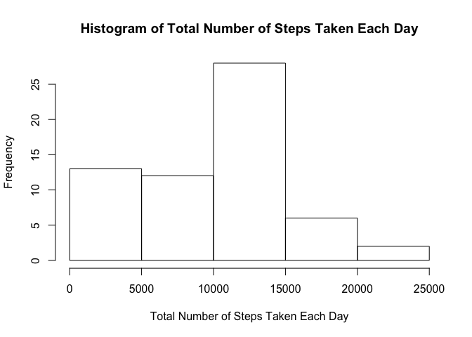
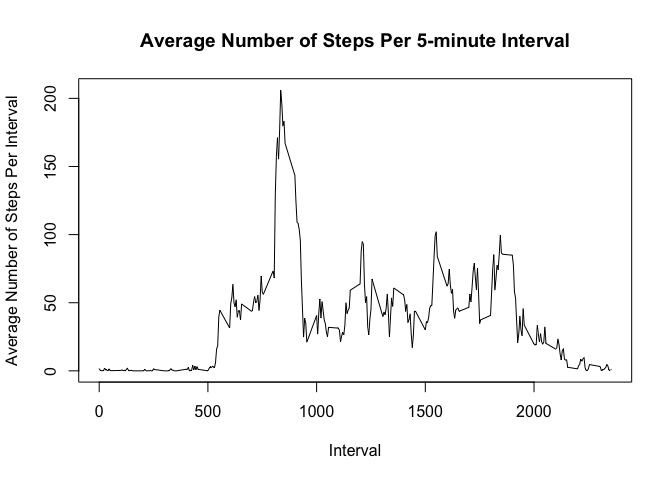
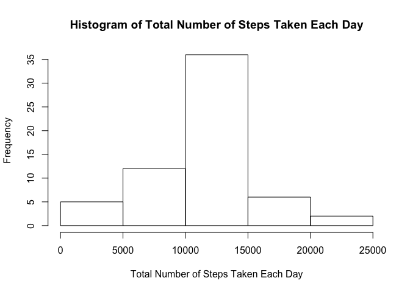
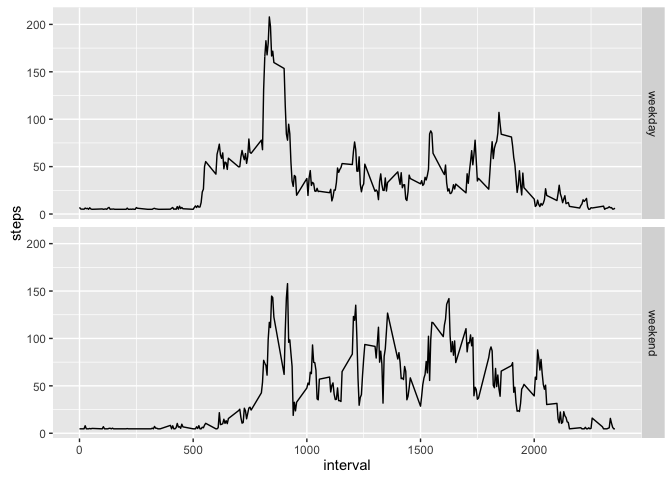

# Reproducible Research: Peer Assessment 1


## Loading and preprocessing the data


```r
rawdata<-read.csv("activity.csv",colClasses = c("numeric","Date","numeric"))
```

## What is mean total number of steps taken per day?
For this part of the assignment, you can ignore the missing values in the dataset.

* Calculate the total number of steps taken per day


```r
totalstepsperday<-aggregate(rawdata$steps,by=list(rawdata$date),sum,na.rm=TRUE)
names(totalstepsperday)<-c("Date","Total.Steps.Per.Day")
```

* If you do not understand the difference between a histogram and a barplot, research the difference between them. Make a histogram of the total number of steps taken each day


```r
hist(totalstepsperday$Total.Steps.Per.Day,
     main="Histogram of Total Number of Steps Taken Each Day",
     xlab="Total Number of Steps Taken Each Day")
```

<!-- -->

* Calculate and report the mean and median of the total number of steps taken per day


```r
print(paste("The mean number of total steps taken per day is: ",
            round(mean(totalstepsperday$Total.Steps.Per.Day,na.rm=TRUE),
                  digits=2)))
```

```
## [1] "The mean number of total steps taken per day is:  9354.23"
```

```r
print(paste("The median number of total steps taken per day is: ",
            round(median(totalstepsperday$Total.Steps.Per.Day,na.rm=TRUE),
                  digits=2)))
```

```
## [1] "The median number of total steps taken per day is:  10395"
```

## What is the average daily activity pattern?
* Make a time series plot (i.e. 𝚝𝚢𝚙𝚎 = "𝚕") of the 5-minute interval (x-axis) and the average number of steps taken, averaged across all days (y-axis)


```r
averagestepsperinterval<-aggregate(rawdata$steps,by=list(rawdata$interval),mean,na.rm=TRUE)
names(averagestepsperinterval)<-c("Interval","Average.Steps.Per.Interval")
plot(x=averagestepsperinterval$Interval,y=averagestepsperinterval$Average.Steps.Per.Interval,
     type="l",main="Average Number of Steps Per 5-minute Interval",
     xlab="Interval",
     ylab="Average Number of Steps Per Interval")
```

<!-- -->

* Which 5-minute interval, on average across all the days in the dataset, contains the maximum number of steps?


```r
averagestepsperinterval[which.max(averagestepsperinterval$Average.Steps.Per.Interval),]
```

```
##     Interval Average.Steps.Per.Interval
## 104      835                   206.1698
```

```r
print(paste("The 5-minute-interval that contains the maximum number of steps was",
            averagestepsperinterval[which.max(averagestepsperinterval$Average.Steps.Per.Interval),1],"with an average of",round(averagestepsperinterval[which.max(averagestepsperinterval$Average.Steps.Per.Interval),2],digits=1),"steps"))
```

```
## [1] "The 5-minute-interval that contains the maximum number of steps was 835 with an average of 206.2 steps"
```

## Imputing missing values

Note that there are a number of days/intervals where there are missing values (coded as 𝙽𝙰). The presence of missing days may introduce bias into some calculations or summaries of the data.

* Calculate and report the total number of missing values in the dataset (i.e. the total number of rows with 𝙽𝙰s)


```r
print(paste("The total number of missing values in the data set are: ",
            sum(is.na(rawdata))))
```

```
## [1] "The total number of missing values in the data set are:  2304"
```

* Devise a strategy for filling in all of the missing values in the dataset. The strategy does not need to be sophisticated. For example, you could use the mean/median for that day, or the mean for that 5-minute interval, etc.


```r
print("The chosen strategy is to replace the NAs with the median for the data set")
```

```
## [1] "The chosen strategy is to replace the NAs with the median for the data set"
```

The chosen strategy is to replace the NAs with the median for the data set

* Create a new dataset that is equal to the original dataset but with the missing data filled in.

```r
NAremoved_rawdata<-rawdata
```

* Make a histogram of the total number of steps taken each day and calculate and report the mean and median total number of steps taken per day. Do these values differ from the estimates from the first part of the assignment? What is the impact of imputing missing data on the estimates of the total daily number of steps?


```r
NAremoved_rawdata[is.na(NAremoved_rawdata)]<-mean(rawdata$steps,na.rm=TRUE)
NAremoved_totalsteps<-aggregate(NAremoved_rawdata$steps,by=list(NAremoved_rawdata$date),
                                sum,na.rm=FALSE)
names(NAremoved_totalsteps)<-c("Date","Total.Steps.Per.Day")
hist(NAremoved_totalsteps$Total.Steps.Per.Day,
     main="Histogram of Total Number of Steps Taken Each Day",
     xlab="Total Number of Steps Taken Each Day")
```

<!-- -->

```r
print(paste("The mean number of steps per day is",
            round(mean(NAremoved_totalsteps$Total.Steps.Per.Day),digits=2)))
```

```
## [1] "The mean number of steps per day is 10766.19"
```

```r
print(paste("The median number of steps per day is",
            round(median(NAremoved_totalsteps$Total.Steps.Per.Day),digits=2)))
```

```
## [1] "The median number of steps per day is 10766.19"
```

```r
print("Replacing the NAs with the mean for the ENTIRE set of data brought both the mean and median up.")
```

```
## [1] "Replacing the NAs with the mean for the ENTIRE set of data brought both the mean and median up."
```

## Are there differences in activity patterns between weekdays and weekends?

For this part the 𝚠𝚎𝚎𝚔𝚍𝚊𝚢𝚜() function may be of some help here. Use the dataset with the filled-in missing values for this part.

* Create a new factor variable in the dataset with two levels – “weekday” and “weekend” indicating whether a given date is a weekday or weekend day.


```r
library(dplyr)
```

```
## 
## Attaching package: 'dplyr'
```

```
## The following objects are masked from 'package:stats':
## 
##     filter, lag
```

```
## The following objects are masked from 'package:base':
## 
##     intersect, setdiff, setequal, union
```

```r
#Note: I am using the data that did NOT aggregate the steps by days (and has the NA values filled in)
weekdaydata<-mutate(NAremoved_rawdata,weekday=weekdays(NAremoved_rawdata$date))
weekdayvalues<-c("Monday","Tuesday","Wednesday","Thursday","Friday")

for (i in 1:length(weekdaydata$date)){
        if(sum(weekdaydata$weekday[i]==weekdayvalues)==1){
                weekdaydata[i,5]<-"weekday"
        }
        else{
                weekdaydata[i,5]<-"weekend"
        }
}

names(weekdaydata)<-c("steps","date","interval","day.of.week","weekday_v_weekend")
```

* Make a panel plot containing a time series plot (i.e. 𝚝𝚢𝚙𝚎 = "𝚕") of the 5-minute interval (x-axis) and the average number of steps taken, averaged across all weekday days or weekend days (y-axis). See the README file in the GitHub repository to see an example of what this plot should look like using simulated data.


```r
library(ggplot2)
averageweekdaydata <- aggregate(steps ~ interval + weekday_v_weekend, 
                                data = weekdaydata, mean)

ggplot(averageweekdaydata, aes(interval,steps)) + geom_line() + 
        facet_grid(weekday_v_weekend ~ .) 
```

<!-- -->
